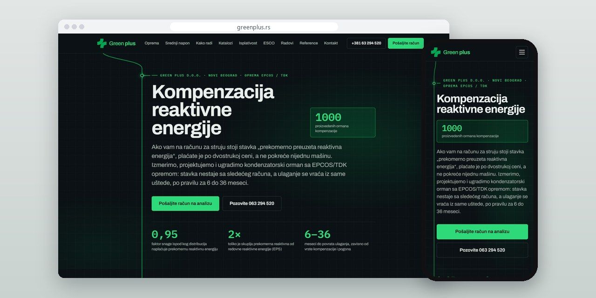
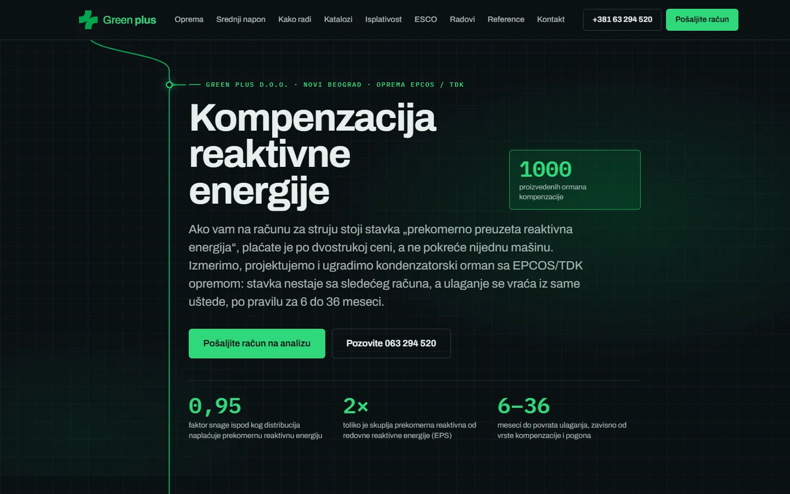
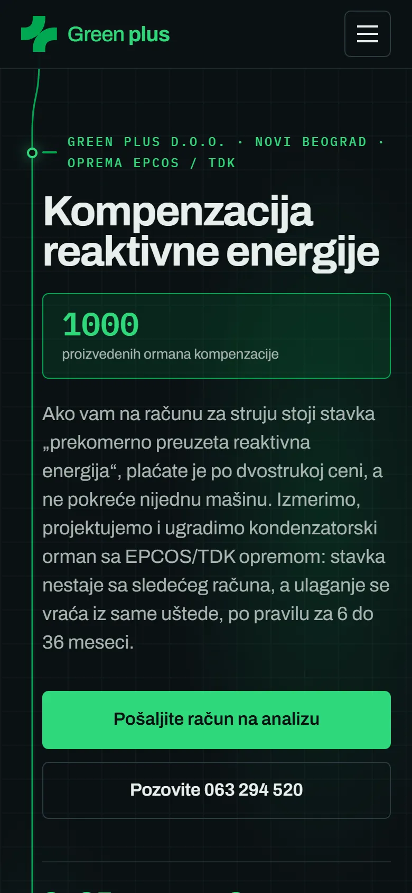
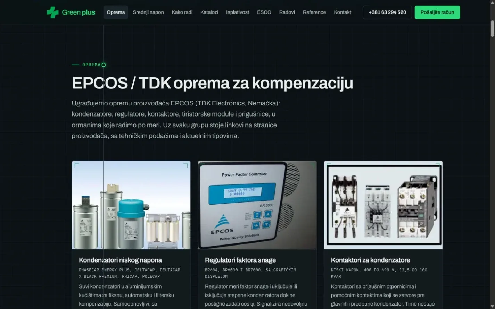
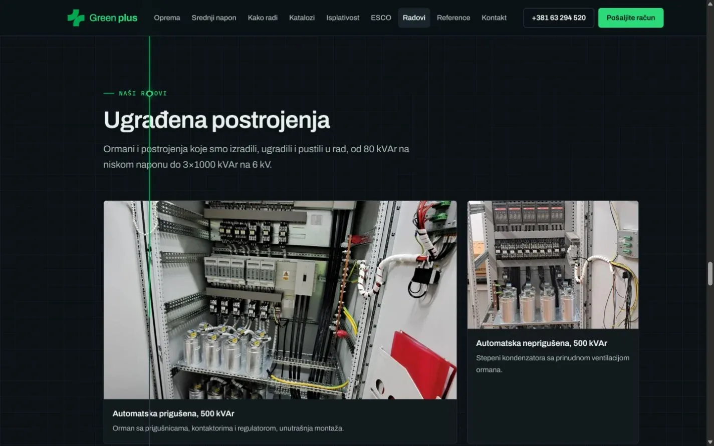

# Green Plus

One-page site for a reactive power compensation company that takes an industrial buyer from the electricity bill to measurement, equipment and a quote.

**[greenplus.rs](https://greenplus.rs/)** · [Case study (in Serbian)](https://svilenkovic.com/radovi/green-plus) · [Srpski](README.sr.md)

> [!NOTE]
> Client project. The source code belongs to the client and stays in a private repository. This page describes what I built and how.

<table>
  <tr><td><b>Client</b></td><td>Green Plus</td></tr>
  <tr><td><b>Industry</b></td><td>Reactive power compensation for industry: measurement, design and installation</td></tr>
  <tr><td><b>Location</b></td><td>Belgrade, Serbia</td></tr>
  <tr><td><b>Type</b></td><td>One-page website</td></tr>
  <tr><td><b>My role</b></td><td>Design, development, SEO, hosting and maintenance</td></tr>
  <tr><td><b>Stack</b></td><td>PHP 8.3, GSAP, Lenis, JSON-LD</td></tr>
</table>

## About the project

Green Plus measures, designs and installs reactive power compensation with EPCOS/TDK equipment, on low and medium voltage. What they sell has to be explained before anyone buys it. The page follows the order in which a customer decides: the excess reactive energy charge on the bill, measurement on site, the calculation and quote, and then installation.

The form does most of the selling. It asks for the company, a contact person and, if known, the monthly amount of that charge. It also takes the bill itself as a PDF, JPG or PNG up to 10 MB, so the first call starts from numbers instead of a general question about price. Spam protection stays out of sight: the browser solves a small task from the server in a Web Worker while the visitor types, and a one-click check appears only if that fails.

## What I built

- Sections on low and medium voltage equipment, how the work is done, types of compensation, payback and ESCO financing, installed plants and references
- Equipment groups linked to the manufacturer's product pages, and two catalogues to download as PDF
- A quote form with a drag-and-drop field for the bill, a CSRF token, a honeypot and an invisible proof-of-work check
- GSAP with the ScrollTrigger and DrawSVG plugins, and Lenis, all served from the same server along with the fonts
- A call and send-the-bill bar fixed to the bottom of the screen on phones
- Structured data for the company, its services, the gallery and the FAQ, and a sitemap that lists the catalogues

## Results

| | Performance | Accessibility | Best practices | SEO |
| :-- | :-: | :-: | :-: | :-: |
| Mobile | 98 | 100 | 100 | 100 |
| Desktop | 100 | 100 | 100 | 100 |

PageSpeed Insights, lab test of the live site, September 2026. Security headers: 6 of 6. HTML validator: no errors. axe accessibility check: no violations. Structured data: `FAQPage`, `ImageGallery`, `Organization`, `ProfessionalService`, `Service`.

## Screenshots

<table>
  <tr>
    <td width="68%" valign="top"></td>
    <td width="32%" valign="top"></td>
  </tr>
</table>

Equipment and technical data, presented by product group

Completed projects with photos of the equipment on site

---

Built by [D. Svilenković](https://svilenkovic.com).
